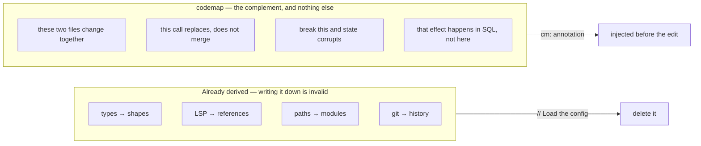
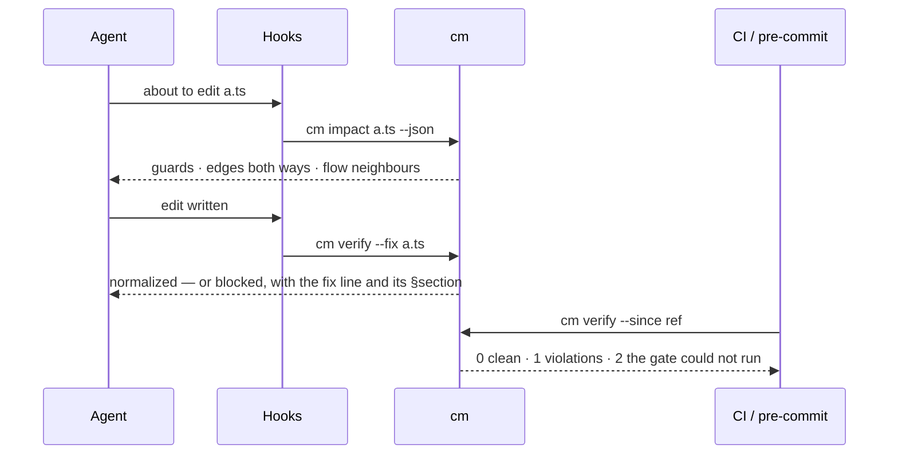
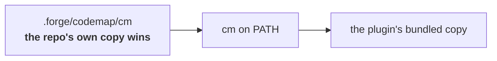

<div align="center">

# codemap

**Declare the couplings no tool can derive — and hand them to whoever edits the file.**

[](https://github.com/SidCorp-co/codemap/actions/workflows/ci.yml)
[](https://docs.claude.com/en/docs/claude-code/plugins)
[](.claude-plugin/plugin.json)
[](cli/lib/registry.mjs)
[](LICENSE)

</div>

---

## What it carries



One rule produces both halves: **if a tool can derive it, you may not write it.**

## How it reads

```ts
// cm:guard terminal pipeline_runs.status must route through cascadeCancelChildJobs
// cm:edge  contract -> packages/core/src/pipeline/failure-classifier.ts — bracketed token needs a matching pattern
// cm:flow  job-dispatch/claim-row after:pick-runner — cap gate already passed
```

An agent opens that file. Before its edit lands, it is told:

```
codemap: declared couplings for a.ts that no type-checker or LSP can derive.
GUARD (a.ts:3) — terminal pipeline_runs.status must route through cascadeCancelChildJobs
EDGE contract -> b.ts — bracketed token must have a matching pattern there
FLOW job-dispatch: this file owns claim-row; adjacent steps pick-runner@b.ts:3
```

Comments stop being **output** (noise) and become **input routing**. Killing comment spam is the side
effect, not the goal.

## Where it runs



All four triggers call **one** checker, so the edit-time gate and the CI gate cannot drift apart.
Detail: [`docs/enforcement.md`](docs/enforcement.md).

## The five annotations

| Tag | Consumer | For |
|---|---|---|
| `cm:edge <kind> -> <target>` | `cm impact` | a coupling nothing links — `contract` · `ordering` · `lockstep` · `sideeffect` · `naming` · `protocol` |
| `cm:guard <text>` | `PreToolUse` | an invariant whoever touches this must obey |
| `cm:flow <flow>/<step> [after:]` | `cm flow` | a step of a runtime sequence spanning files, languages, processes |
| `cm:hack ISS-<n> until:<cond>` | `cm verify` | a live workaround with an exit condition |
| `cm:why <text>` | read in place | rationale, so the guard channel stays expensive |

There is no `cm:todo` — the tracker owns outstanding work. Which tag, when, and what breaks without
it: [`patterns/`](patterns/).

## Install

```bash
claude plugin marketplace add SidCorp-co/codemap
claude plugin install forge-codemap@forge
```

Zero dependencies, bare `node` ≥ 18 — the hooks work the moment the plugin is enabled. Onboarding a
legacy repo is green on the first run, because its existing comments are frozen as a baseline by
content, so reformatting, moving code and deleting old comments are all free:

```bash
cm init      # registry + freeze existing comments
cm install   # vendor the checker into .forge/codemap/ — commit it
cm verify    # green immediately, even in a legacy codebase
cm propose   # candidates from evidence already in the repo — a proposal, never a fact
```



That order is the enforcement model in one line: a contributor whose plugin is a version ahead cannot
change the verdict on your repo. Every verb, diagnostic and language policy ships **inside** the
checker — `cm help`, `cm help codes`, `cm help languages` — so there is nothing to look up here.

**Not on Claude Code?** [`adapters/mcp/`](adapters/mcp/README.md) serves the same answers to any MCP
host, and the cheapest integration needs no server at all: one line in your agent instructions saying
*run `cm impact <file>` before editing it.*

**Not visible to reviewers?** `cm pr-comment --base <ref>` ([`adapters/ci/pr-comment.yml`](adapters/ci/pr-comment.yml))
leaves one comment on the pull request itself — a lockstep edge with only one side changed, or a
guarded line the diff crossed. Advisory only; `cm verify` stays the gate.

## Field data

Three private production repos, measured by the tool rather than counted by hand:

| | Repo A · Go + Next.js | Repo B · TypeScript | Repo C · PHP |
|---|---|---|---|
| Source lines | 503 859 | 261 513 | monorepo |
| Prose density | **5.5%** | **5.3%** | — |
| godoc above exported declarations flagged | **0** in 225k Go lines | — | 0 docblocks touched |
| Latent cross-file edges already sitting in prose | **134** | — | — |

Two unrelated teams, 2× apart in size, land on the same comment density — that is the size of the
surface, not a property of either team. About half the flagged prose compresses away and **~45%
carries rationale worth keeping**, which is kept, as `cm:` annotations the hook then injects. Method,
per-language breakdown, sampled verdicts and four known spec gaps: [`CASE-STUDY.md`](CASE-STUDY.md).

## Documents

| | |
|---|---|
| [`VISION.md`](VISION.md) | the ceiling — five rungs, and what may never be built on the way |
| [`NORTH-STAR.md`](NORTH-STAR.md) | today, the one number that decides this, and the criteria that kill it |
| [`spec/SPEC.md`](spec/SPEC.md) | codemap/1 — grammar, diagnostics, registry |
| [`patterns/`](patterns/) | which tag to reach for, and when a constraint has earned one |
| [`docs/enforcement.md`](docs/enforcement.md) | who enforces, what each trigger does, per-language policy, adoption tiers |
| [`CASE-STUDY.md`](CASE-STUDY.md) | field data, in full |

## Layout

The repository root **is** the plugin: what Claude Code installs is this tree.

```
spec/       codemap/1 + JSON schema      cli/       the engine, zero dependencies
patterns/   the pattern book             bin/cm     stable entrypoint — symlink this
skills/     the skill an agent loads     hooks/     what fires before and after an edit
adapters/   ci/ · mcp/ — delivery        tests/     golden corpus, 369 cases
            beyond Claude Code
```

`plugins/forge-codemap/scripts/cm.mjs` is a forwarding shim for repos whose upgrade workflow hardcodes
the pre-0.17 path; it carries a `cm:hack` with its exit condition.

## History

Previously `forge-pipeline-skills`, which also carried nine pipeline skills. Those are superseded by
[`SidCorp-co/forge-plugin`](https://github.com/SidCorp-co/forge-plugin) and remain reachable at the
tag [`pipeline-final`](https://github.com/SidCorp-co/codemap/tree/pipeline-final). The marketplace is
still named `forge`, so `forge-codemap@forge` keeps resolving.

## License

[MIT](LICENSE) © SidCorp-co
