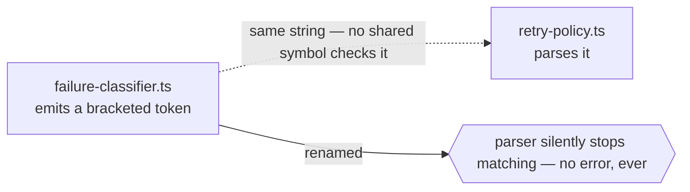

# `contract`



## Which side carries it

**The annotation goes in the side that emits the string, and points at the side that parses it.**
The emitter is where a rename starts, so that is the file whose editor has to be told; the parser
has nothing to warn about until the emitter moves. Nothing a tool can see decides this — a shared
literal carries no trace of which side wrote it — so `cm propose` offers both directions and names
neither. You pick.

So the annotation lives in `failure-classifier.ts`, the emitter above, and reads:

```ts
// cm:edge contract -> packages/api/src/retry-policy.ts — the bracketed token this emits must have a matching pattern there
```

## When it applies

- One side **emits** a string, the other **parses** it: an error code, a log prefix, a bracketed
  token, a serialized enum.
- Two implementations of the same wire format in different languages: a Rust writer and a TypeScript
  reader, a Go struct tag and a SQL column, a queue message and its consumer.
- A regex in one file that only makes sense against text produced in another.

## How to spot the candidate

Search for string literals that appear in exactly two places in two languages. In field data, the
comment that already says *"must match the pattern in …"* is the single most common prose form of a
latent `contract` edge.

## Anti-pattern

Do not use `contract` where a shared type already exists. If both sides import the same enum, the
compiler is the contract and the annotation is a stale copy of it — `CM2xx` territory. `contract` is
for the case where the agreement has **no** shared symbol.

## Anchor it when you can

`-> path/to/file.ts#symbolName` verifies that the symbol is still there, not merely the file. In one
production repo, 110 of 186 edges carry an anchor; without one, the edge is verified no further than
"the file still exists".
