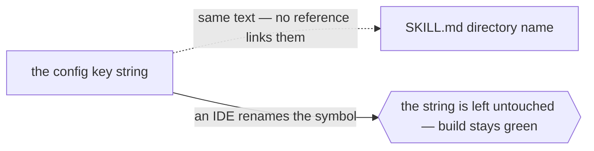

# `naming`



```ts
// cm:edge naming -> skills/codemap/SKILL.md — the config key must equal the skill directory name
```

## When it applies

- A config map key that must equal a directory name, a class name, a route segment, or an enum value.
- Convention-based dispatch: a handler found by `require(`./${type}.js`)`, a template chosen by
  `views/${name}.html`, a job resolved from a string.
- A CSS class, a test id, or a feature-flag key shared between two codebases.

## How to spot the candidate

Anywhere a string is used to *find* something: dynamic import, reflection, a registry keyed by name,
a filename derived at runtime. If a grep for the literal is the only way to find the other side, it
is a `naming` edge.

## Anti-pattern

Do not use `naming` for a value both sides import from one constant. That is a reference, LSP sees
it, and the annotation would restate what a tool derives.
