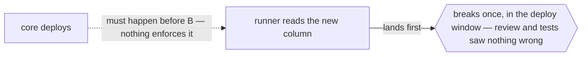

# `ordering`



```go
// cm:edge ordering -> deploy/runner.yaml — core must be deployed before the runner reads the new column
```

## When it applies

- Deploy or migration sequence: schema before the code that reads it, core service before the client
  that calls a new endpoint.
- Initialization order that is legal to violate: a registry that must be populated before the first
  lookup, a feature flag that must exist before the code branching on it ships.
- Two async operations whose success looks identical in either order but whose failure does not.

## How to spot the candidate

Look for the incident that produced a runbook line. "Deploy X first" living in a wiki, a PR
description, or a person's memory is an `ordering` edge that has already been paid for and cannot be
spent.

## Anti-pattern

If the order is enforced — an `await`, a dependency in the DAG, a foreign key — do not annotate it.
`ordering` describes an order the machine will happily let you break.
