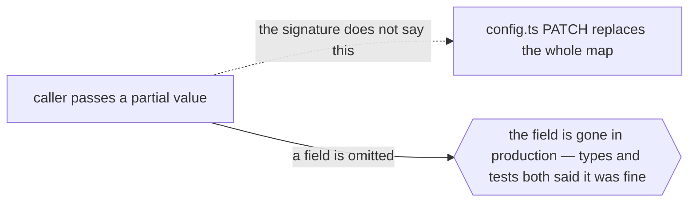

# `protocol`



```ts
// cm:edge protocol -> packages/api/src/config.ts — PATCH replaces the whole map; it does not deep-merge
```

## When it applies

- Replace vs merge: an update call whose type says `Partial<T>` but whose implementation overwrites
  the whole field.
- Idempotency, retry and at-least-once semantics: the caller must be safe to run twice, and nothing
  in the type says so.
- Ownership of a lock, a transaction, or a cursor: who opens it, who must close it, and what happens
  if the callee throws.
- A parameter whose absence means "leave unchanged" versus "set to null" — the single most expensive
  ambiguity in any update API.

## How to spot the candidate

Read the update paths. Every place a function takes a partial and writes a whole, or takes a whole
and writes a partial, is a `protocol` edge. The second source is the review comment that says
*"careful, this replaces"* — a coupling already found and recorded in a channel nothing indexes.

## Anti-pattern

If the semantics can be encoded in the type — a dedicated `Replace<T>` wrapper, a discriminated
union, a named method — encode them. `protocol` is for the semantics you cannot make the compiler
carry, not for the ones you did not get around to.
