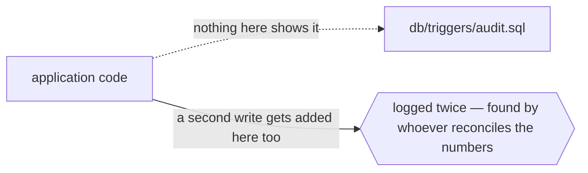

# `sideeffect`



```ts
// cm:edge sideeffect -> db/triggers/audit.sql — the trigger writes the audit row; do not write it here too
```

## When it applies

- A database trigger, rule or cascade does work the application code does not show.
- A scheduled job, a queue consumer, or another service reacts to this write.
- A filesystem watcher, a webhook, or an external system observes the change.

## How to spot the candidate

Every `CREATE TRIGGER`, every cron entry, every queue subscription is one end of a `sideeffect` edge
whose other end is a file nobody has annotated. Start there — the SQL side is enumerable, the code
side is not.

## Anchor across process boundaries

When the other side is not in the tree at all, declare it once with `cm new external <name>` and
point the edge at that name, so the target is verifiable rather than a free-text guess.
